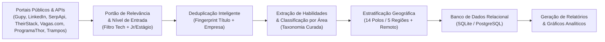

# Mapeamento de Skills em Tecnologia no Brasil (PIBIC)

[](https://github.com/diasgarcia/tech-skills-br/actions/workflows/ci.yml)

[](https://www.python.org/)
[](https://fastapi.tiangolo.com/)
[](api/database.py)
[](docs/manual_de_uso.md)
[](docs/arquitetura_tecnica.md)
[](#contexto-e-objetivo-da-pesquisa)
[](#contexto-e-objetivo-da-pesquisa)

Projeto de pesquisa científica (PIBIC / Iniciação Científica) voltado para a **mineração de dados, extração de habilidades técnicas (*skills*) e análise do mercado de trabalho de tecnologia no Brasil**, comparando a demanda real das empresas com os referenciais curriculares do **MEC (Diretrizes Curriculares Nacionais - DCNs)** e da **Sociedade Brasileira de Computação (SBC)**.

> *Projeto derivado do [vagas-tech-junior](docs/arquitetura_tecnica.md#agradecimentos-e-créditos).*

---

## Contexto e Objetivo da Pesquisa

### Problema de Pesquisa

> **"Em que medida as diretrizes curriculares do MEC (DCNs) e referenciais pedagógicos da SBC para os cursos superiores de Computação e Engenharia de Software preparam os egressos para as tecnologias e habilidades exigidas pelo mercado de trabalho brasileiro contemporâneo?"**

Para responder a essa pergunta com evidências quantitativas e reprodutíveis, este projeto implementa um pipeline completo de coleta multi-fonte, amostragem estratificada por polos tecnológicos, extração de tecnologias por taxonomia curada, deduplicação e análise estatística.

---

## Metodologia e Pipeline de Dados



### 1. Coleta Multi-fonte Abrangente

A coleta combina portais de alto volume com APIs especializadas de mercado:

- **Fontes Nativas:** Gupy, LinkedIn Jobs, Vagas.com.br, ProgramaThor e Trampos.co.
- **APIs Especializadas:** SerpApi (Google Jobs) e TheirStack API.

### 2. Amostragem Estratificada por Macrorregiões e Polos Nacionais

Para evitar o viés de concentração geográfica exclusiva no Sudeste e mapear a demanda de tecnologia em todo o território brasileiro, a taxonomia e os coletores cobrem as 5 macrorregiões do país, todas as 27 capitais e polos tecnológicos consolidados:

- **Sudeste:** São Paulo, Campinas, Rio de Janeiro, Belo Horizonte, Vitória, São José dos Campos, Ribeirão Preto, etc.
- **Sul:** Curitiba, Florianópolis, Porto Alegre, Joinville, Londrina, Maringá, Caxias do Sul, etc.
- **Nordeste:** Recife (Porto Digital), Salvador, Fortaleza, Natal, João Pessoa, Maceió, Aracaju, São Luís, Teresina.
- **Centro-Oeste:** Brasília, Goiânia, Cuiabá, Campo Grande.
- **Norte:** Manaus, Belém, Porto Velho, Palmas, Macapá, Boa Vista, Rio Branco.
- **Remoto Nacional:** Vagas 100% remotas de abrangência nacional.


### 3. Extração e Normalização de Skills (Taxonomia Curada)

Emprega vocabulário controlado com centenas de sinônimos mapeados em `scraper/rules/skills.yml`, visando alta precisão terminológica e com regras específicas para redução de falsos positivos:

- *Exemplo:* `"React"`, `"React.js"`, `"ReactJS"`, `"react js"` $\rightarrow$ **`React`**.

### 4. Portão de Relevância e Senioridade

- **Filtro de Senioridade:** Foco em nível de entrada (*Júnior*, *Estágio*, *Trainee*, *Aprendiz*).
- **Portão de Relevância:** Descarta automaticamente vagas fora do escopo de TI (ex: *Analista Contábil Jr*, *Analista Fiscal Jr*) capturadas por buscas genéricas dos portais.

---

## Trilha de Execução Rápida

Consulte o **[Manual de Uso e Guia de Execução](docs/manual_de_uso.md)** para a documentação completa de todos os parâmetros e opções.

```powershell
python scripts/import_csv.py --csv seed/vagas.csv

# 1. Executa a coleta geral gratuita (ilimitada - Gupy, LinkedIn, Vagas.com, ProgramaThor, Trampos):
python main.py

# 2. Executa a coleta complementar SerpApi (Google Jobs - sob demanda):
python main.py --sources serpapi --max-pages 1

# 3. Executa a coleta complementar TheirStack (calibrada para a cota):
python main.py --sources theirstack --max-pages 1 --page-size 8

# 4. Consolida e importa tudo para o SQLite:
python scripts/import_csv.py

# 5. Atualiza o snapshot versionado para o GitHub (seed/vagas.csv):
python scripts/export_seed.py

# 6. Gera o relatório estatístico consolidado da base:
python scripts/report_db.py
```

---

## 🌐 Site Público & API JSON Estática (GitHub Pages)

O projeto disponibiliza um painel web *roots* (minimalista e instantâneo) e uma **API JSON estática pública com CORS liberado** hospedada no GitHub Pages:

- **Dashboard Web Roots:** **[https://diasgarcia.github.io/tech-skills-br/](https://diasgarcia.github.io/tech-skills-br/)**
- **Endpoints Públicos (Prontos para Postman, Python, cURL e Power BI):**
  - `GET https://diasgarcia.github.io/tech-skills-br/api/resumo.json` $\rightarrow$ Metadados gerais, KPIs e distribuições
  - `GET https://diasgarcia.github.io/tech-skills-br/api/areas.json` $\rightarrow$ Ranking das 17 áreas técnicas
  - `GET https://diasgarcia.github.io/tech-skills-br/api/tecnologias.json` $\rightarrow$ Ranking de tecnologias demandadas
  - `GET https://diasgarcia.github.io/tech-skills-br/api/vagas.json` $\rightarrow$ Base completa com as 1.662 vagas estruturadas

---

## 🚀 API REST Local (FastAPI)

Para consultas avançadas e filtros dinâmicos via backend relacional local:

```powershell
uvicorn api.app:app --reload
```

Acesse a documentação interativa no navegador: **[http://localhost:8000/docs](http://localhost:8000/docs)**.

---

## Estrutura do Repositório

```text
tech-skills-br/
├── .github/
│   ├── pages/             # Site roots e API JSON estática pública (.github/pages/api/)
│   └── workflows/         # Automação de CI e coleta diária de segunda a sexta (GitHub Actions)
├── api/                   # API FastAPI (endpoints, modelos ORM, schemas Pydantic)
├── data/                  # Base de dados local SQLite (vagas.db)
├── docs/                  # Documentação acadêmica e relatórios consolidados
│   ├── manual_de_uso.md   # Guia detalhado de todos os comandos e parâmetros
│   ├── arquitetura_tecnica.md # Especificação técnica da arquitetura
│   └── relatorios/        # Relatório consolidado e gráficos analíticos PNG
├── output/                # Relatórios em Markdown, rankings CSV e gráficos PNG
├── scraper/               # Mecanismo de mineração e processamento de dados
│   ├── classifier.py      # Classificador de 17 áreas de tecnologia
│   ├── dedupe.py          # Deduplicação canônica por URL e identidade de empresa
│   ├── geo.py             # Classificador geográfico (27 capitais + 350 polos)
│   ├── skills.py          # Extrator de tecnologias (taxonomia curada com +200 skills)
│   ├── rules/             # Regras declarativas em YAML (skills, áreas, localizações)
│   └── sources/           # Implementação dos coletores por portal / API
├── scripts/               # Ferramentas de CLI
│   ├── import_csv.py      # Importação, deduplicação e enriquecimento no banco
│   ├── export_seed.py     # Exportação do snapshot consolidado para seed/vagas.csv
│   ├── export_pages_data.py # Geração dos endpoints JSON estáticos para .github/pages/api/
│   └── report_db.py       # Emissão de relatório estatístico e gráficos PNG
├── seed/                  # Snapshot de dados versionado para reprodutibilidade (seed/vagas.csv)
└── tests/                 # Suíte com +270 testes automatizados (pytest)
```


