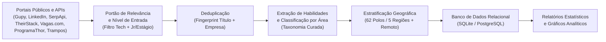

# Mapeamento de Skills em Tecnologia no Brasil (PIBIC)

[](https://github.com/diasgarcia/tech-skills-br/actions/workflows/ci.yml)
[](https://www.python.org/)
[](api/database.py)
[](docs/manual_de_uso.md)
[](docs/arquitetura_tecnica.md)

Projeto de pesquisa científica (PIBIC / Iniciação Científica) que coleta, extrai e analisa as habilidades técnicas pedidas em vagas de tecnologia no Brasil. Os dados coletados são comparados com os referenciais curriculares do MEC (Diretrizes Curriculares Nacionais) e da Sociedade Brasileira de Computação (SBC).

## Problema de Pesquisa

> **"Em que medida as diretrizes curriculares do MEC (DCNs) e os referenciais da SBC preparam os egressos de Computação para as tecnologias e habilidades exigidas pelo mercado de trabalho brasileiro?"**

Para responder a essa pergunta com evidências quantitativas e reprodutíveis, o projeto executa um pipeline de coleta multi-fonte, extração de tecnologias por taxonomia curada, deduplicação e análise estatística.

## Metodologia e Pipeline de Dados



### 1. Coleta Multi-fonte

- **Fontes gratuitas:** Gupy, LinkedIn Jobs, Vagas.com.br, ProgramaThor e Trampos.co.
- **APIs especializadas:** SerpApi (Google Jobs) e TheirStack API.

### 2. Amostragem Estratificada por Polos e Macrorregiões

Os coletores cobrem as 5 macrorregiões do país e 62 polos tecnológicos, para evitar a concentração da amostra no Sudeste. Vagas 100% remotas de abrangência nacional formam uma categoria própria.

### 3. Extração e Normalização de Skills

O extrator usa um vocabulário controlado em `scraper/rules/skills.yml`, com mais de 200 tecnologias canônicas e centenas de sinônimos. Exemplo: `"React"`, `"React.js"`, `"ReactJS"` e `"react js"` viram `React`.

### 4. Portão de Relevância e Senioridade

- **Senioridade:** foco em nível de entrada (Júnior, Estágio, Trainee, Aprendiz).
- **Portão de relevância:** descarta vagas fora do escopo de TI (ex: *Analista Contábil Jr*, *Analista Fiscal Jr*) que as buscas genéricas dos portais devolvem.

## Execução Rápida

O [Manual de Uso](docs/manual_de_uso.md) documenta todos os parâmetros e opções.

```powershell
# 0. Primeira execução: carrega o histórico versionado no SQLite local.
python scripts/import_csv.py --csv seed/vagas.csv

# 1. Coleta gratuita (Gupy, LinkedIn, Vagas.com, ProgramaThor, Trampos):
python main.py

# 2. Coleta complementar SerpApi (Google Jobs):
python main.py --sources serpapi --max-pages 1

# 3. Coleta complementar TheirStack:
python main.py --sources theirstack --max-pages 1 --page-size 8

# 4. Consolida as coletas no SQLite:
python scripts/import_csv.py

# 5. Atualiza o snapshot versionado (seed/vagas.csv):
python scripts/export_seed.py

# 6. Gera o relatório estatístico consolidado:
python scripts/report_db.py
```

## Site Público e API JSON Estática (GitHub Pages)

O projeto publica um painel web minimalista e uma API JSON estática com CORS liberado no GitHub Pages:

- **Dashboard:** [https://diasgarcia.github.io/tech-skills-br/](https://diasgarcia.github.io/tech-skills-br/)
- **Endpoints:**
  - `GET https://diasgarcia.github.io/tech-skills-br/api/resumo.json` -> metadados, KPIs e distribuições
  - `GET https://diasgarcia.github.io/tech-skills-br/api/areas.json` -> ranking das áreas técnicas
  - `GET https://diasgarcia.github.io/tech-skills-br/api/tecnologias.json` -> ranking de tecnologias demandadas
  - `GET https://diasgarcia.github.io/tech-skills-br/api/vagas.json` -> base completa de vagas estruturadas

## Estrutura do Repositório

```text
tech-skills-br/
├── .github/
│   ├── pages/             # Site e API JSON estática (.github/pages/api/)
│   └── workflows/         # CI e coleta diária (GitHub Actions)
├── api/                   # Banco, modelos ORM e utilitários dos scripts de consolidação
├── data/                  # Base de dados local SQLite (vagas.db)
├── docs/                  # Documentação e relatórios consolidados
│   ├── manual_de_uso.md   # Guia de comandos e parâmetros
│   ├── arquitetura_tecnica.md # Especificação técnica da arquitetura
│   └── relatorios/        # Relatório consolidado e gráficos PNG
├── output/                # Relatórios em Markdown, rankings CSV e gráficos PNG
├── scraper/               # Mecanismo de mineração e processamento de dados
│   ├── classifier.py      # Classificador de áreas de tecnologia
│   ├── dedupe.py          # Deduplicação canônica por título e empresa
│   ├── geo.py             # Classificador geográfico (polos e macrorregiões)
│   ├── skills.py          # Extrator de tecnologias (taxonomia curada)
│   ├── rules/             # Regras declarativas em YAML (skills, áreas, localizações)
│   └── sources/           # Coletores por portal
├── scripts/               # Ferramentas de CLI
│   ├── import_csv.py      # Importação, deduplicação e enriquecimento no banco
│   ├── export_seed.py     # Exportação do snapshot consolidado (seed/vagas.csv)
│   ├── export_pages_data.py # Geração dos JSON estáticos do Pages
│   └── report_db.py       # Relatório estatístico e gráficos PNG
├── seed/                  # Snapshot de dados versionado (seed/vagas.csv)
└── tests/                 # Suíte com 312 testes automatizados (pytest)
```
