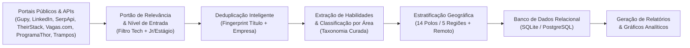

# Mapeamento de Skills em Tecnologia no Brasil (PIBIC)

[](https://github.com/diasgarcia/tech-skills-br/actions/workflows/ci.yml)

[](https://www.python.org/)
[](https://fastapi.tiangolo.com/)
[](api/database.py)
[](docs/manual_de_uso.md)
[](docs/arquitetura_tecnica.md)
[](#contexto-e-objetivo-da-pesquisa)
[](#contexto-e-objetivo-da-pesquisa)

Projeto de pesquisa científica (PIBIC / Iniciação Científica) voltado para a **mineração de dados, extração de habilidades técnicas (*skills*) e análise do mercado de trabalho de tecnologia no Brasil**, comparando a demanda real das empresas com os referenciais curriculares do **MEC (Diretrizes Curriculares Nacionais - DCNs)** e da **Sociedade Brasileira de Computação (SBC)**.

> *Projeto derivado do [vagas-tech-junior](docs/arquitetura_tecnica.md#agradecimentos-e-créditos).*

---

## Contexto e Objetivo da Pesquisa

### Problema de Pesquisa

> **"Em que medida as diretrizes curriculares do MEC (DCNs) e referenciais pedagógicos da SBC para os cursos superiores de Computação e Engenharia de Software preparam os egressos para as tecnologias e habilidades exigidas pelo mercado de trabalho brasileiro contemporâneo?"**

Para responder a essa pergunta com evidências quantitativas e reprodutíveis, este projeto implementa um pipeline completo de coleta multi-fonte, amostragem estratificada por polos tecnológicos, extração de tecnologias por taxonomia curada, deduplicação e análise estatística.

---

## Metodologia e Pipeline de Dados



### 1. Coleta Multi-fonte Abrangente

A coleta combina portais de alto volume com APIs especializadas de mercado:

- **Fontes Nativas:** Gupy, LinkedIn Jobs, Vagas.com.br, ProgramaThor e Trampos.co.
- **APIs Especializadas:** SerpApi (Google Jobs) e TheirStack API.

### 2. Amostragem Estratificada por Polos Regionais

Para evitar o viés de concentração geográfica exclusiva no Sudeste, a coleta cobre as 5 macrorregiões do país e 14 polos tecnológicos consolidados:

- **Sudeste:** São Paulo, Campinas, Rio de Janeiro, Belo Horizonte.
- **Sul:** Curitiba, Florianópolis, Porto Alegre.
- **Nordeste:** Recife (Porto Digital), Salvador, Fortaleza.
- **Centro-Oeste:** Brasília, Goiânia.
- **Norte:** Manaus, Belém.
- **Remoto Nacional:** Vagas 100% remotas de abrangência nacional.

### 3. Extração e Normalização de Skills (Taxonomia Curada)

Emprega vocabulário controlado com centenas de sinônimos mapeados em `scraper/rules/skills.yml`, visando alta precisão terminológica e com regras específicas para redução de falsos positivos:

- *Exemplo:* `"React"`, `"React.js"`, `"ReactJS"`, `"react js"` $\rightarrow$ **`React`**.

### 4. Portão de Relevância e Senioridade

- **Filtro de Senioridade:** Foco em nível de entrada (*Júnior*, *Estágio*, *Trainee*, *Aprendiz*).
- **Portão de Relevância:** Descarta automaticamente vagas fora do escopo de TI (ex: *Analista Contábil Jr*, *Analista Fiscal Jr*) capturadas por buscas genéricas dos portais.

---

## Trilha de Execução Rápida

Consulte o **[Manual de Uso e Guia de Execução](docs/manual_de_uso.md)** para a documentação completa de todos os parâmetros e opções.

```powershell
# 1. Executa a coleta geral gratuita (ilimitada - Gupy, LinkedIn, Vagas.com, ProgramaThor, Trampos):
python main.py

# 2. Executa a coleta complementar SerpApi (Google Jobs - sob demanda):
python main.py --sources serpapi --max-pages 1

# 3. Executa a coleta complementar TheirStack (calibrada para a cota):
python main.py --sources theirstack --max-pages 1 --page-size 8

# 4. Consolida e importa tudo para o SQLite:
python scripts/import_csv.py

# 5. Atualiza o snapshot versionado para o GitHub (seed/vagas.csv):
python scripts/export_seed.py

# 6. Gera o relatório estatístico consolidado da base:
python scripts/report_db.py
```

---

## API REST & Painel Interativo

O projeto disponibiliza uma API REST construída com **FastAPI** e **SQLAlchemy 2.0** para consumo dos dados em pesquisas acadêmicas:

```powershell
uvicorn api.app:app --reload
```

Acesse a documentação interativa no navegador: **[http://localhost:8000/docs](http://localhost:8000/docs)**.

### Endpoints Principais:

- `GET /vagas`: Listagem paginada de vagas com filtros por área, modalidade, polo e tecnologia.
- `GET /tecnologias`: Ranking de tecnologias com contagem de vagas associadas.
- `GET /areas`: Distribuição das vagas por área de especialidade.
- `GET /estatisticas`: Resumo quantitativo global da base de dados.

---

## Estrutura do Repositório

```text
tech-skills-br/
├── api/                   		# API FastAPI (endpoints, modelos ORM, schemas Pydantic)
│   ├── database.py        		# Configuração SQLAlchemy (SQLite / PostgreSQL)
│   ├── models.py          		# Modelos de dados (Vaga, Tecnologia, VagaTecnologia)
│   └── routes/            		# Rotas da API REST
├── data/                  		# Base de dados local (vagas.db)
├── docs/                  		# Documentação acadêmica e manuais
│   ├── arquitetura_tecnica.md 	# Especificação técnica da arquitetura e créditos
│   ├── manual_de_uso.md   		# Guia detalhado de todos os comandos e parâmetros
│   └── relatorios/        		# Relatório consolidado e gráficos analíticos PNG

├── output/                		# Relatórios em Markdown, rankings CSV e gráficos PNG
├── scraper/               		# Mecanismo de mineração e processamento de dados
│   ├── classifier.py      		# Classificador de áreas de tecnologia
│   ├── dedupe.py          		# Deduplicação cruzada entre portais
│   ├── geo.py             		# Classificador geográfico de polos e regiões
│   ├── skills.py          		# Extrator de tecnologias (taxonomia curada)
│   ├── rules/             		# Regras declarativas em YAML (skills, áreas, polos)
│   └── sources/           		# Implementação dos coletores por portal / API
├── scripts/               		# Ferramentas de CLI
│   ├── import_csv.py      		# Importação e consolidação idempotente no banco
│   └── report_db.py       		# Emissão de relatório estatístico do banco
├── seed/                  		# Snapshot de dados versionado para reprodutibilidade
└── tests/                 		# Suíte com +260 testes automatizados (pytest)
```

---

## Executando os Testes

Para validar a integridade dos coletores, classificadores e regras de extração:

```powershell
pytest
```
