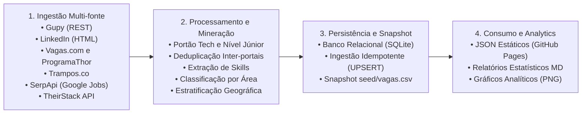

# Arquitetura e Funcionamento Técnico do Sistema

Este documento descreve o funcionamento interno do projeto: camadas, algoritmos de mineração e fluxo de dados.

## 1. Visão Geral da Arquitetura

O sistema tem quatro camadas desacopladas:



## 2. Camada de Ingestão de Dados (`scraper/sources/`)

Todos os coletores herdam da classe abstrata `JobSource` (`scraper/sources/base.py`), que define o contrato de execução e o isolamento de falhas:

```python
class JobSource(ABC):
    @abstractmethod
    def fetch_term(self, term: str) -> list[Job]:
        """Coleta as vagas de um único termo de busca."""
```

### 2.1 Resiliência HTTP (`PoliteSession`)

O tráfego de rede é gerenciado por `PoliteSession` (`scraper/http_client.py`):

- **Retries com backoff exponencial:** em erros transitórios (`429`, `500`, `502`, `503`), as requisições tentam de novo com recuo exponencial.
- **Delay entre chamadas:** intervalo configurável (padrão de 1,5 s) para respeitar os servidores públicos.
- **Headers realistas:** `User-Agent` moderno para evitar falsos bloqueios.

### 2.2 Estratégias por Portal

| Coletor | Tipo de Integração | Paginação | Particularidades |
| :--- | :--- | :--- | :--- |
| **`gupy`** | API REST pública | Offset numérico (`offset = page * limit`) | Limita o lote a 100 itens. |
| **`linkedin`** | HTML scraping | Offset de cards (`start = page * 10`) | Usa `geoId=106057199` (Brasil) para evitar vagas globais. |
| **`vagas`** | HTML scraping | Parâmetro de página (`?pagina=N`) | Usa slugs de termos em URLs amigáveis. |
| **`programathor`** | HTML scraping | Parâmetro de página (`?page=N`) | Os campos do card são identificados por ícone FontAwesome. A busca textual não funciona: a fonte usa filtros nativos de nível de entrada. |
| **`trampos`** | API REST pública | Parâmetro de página (`?page=N`) | Lê o nó `opportunities` da resposta. |
| **`serpapi`** | API REST (Google Jobs) | Cursor token (`next_page_token`) | Acesso ao feed estruturado do Google Jobs no Brasil. |
| **`theirstack`** | API REST B2B | Paginação numérica (`"page": N`) | Enriquece tecnologias e filtra por país (`BR`). |

## 3. Mineração, Normalização e Classificação

### 3.1 Portão de Relevância e Senioridade (`scraper/seniority.py` e `scraper/classifier.py`)

- **Filtro de nível de entrada:** identifica Júnior, Estágio, Trainee e Aprendiz por regex.
- **Descarte de falsos positivos:** vagas sênior que citam "júnior" no corpo (ex: "capacidade de liderar juniores") são descartadas.
- **Portão de relevância técnica:** descarta vagas fora de computação (ex: *Analista Contábil*, *Assistente de DP*) que as buscas amplas devolvem. O portão aceita sinais amplos no título e sinais estritos na descrição, porque o snippet do Vagas.com é cheio de palavras genéricas.

### 3.2 Extração de Tecnologias (`scraper/skills.py`)

A taxonomia é declarada em `scraper/rules/skills.yml`, com mais de 200 tecnologias canônicas e centenas de aliases. As seções do arquivo são os grupos; cada entrada mapeia o nome canônico para os aliases:

```yaml
linguagens:
  Python: [python, python3]
  "C#": ["c#", csharp, c sharp]
  Go: [golang, go lang, ~Go]
```

- **Fronteiras de palavra seguras:** tecnologias com caracteres especiais (`C#`, `C++`, `.NET`, `Node.js`) usam regex próprias, para não quebrar com o `\b` padrão do Python.
- **Aliases case-sensitive:** aliases com maiúscula casam preservando caixa no texto original (`pfSense`). O prefixo `~` restringe a caixa exata (`~Go` casa "Conhecimento de Go", mas não "go live" nem "GO").
- **Seções de benefícios ignoradas:** o texto a partir de seções como "Benefícios" ou "Termos" (`scraper/rules/secoes_descarte.yml`) não é usado na extração, para evitar falsos positivos como "Open English" em parcerias.

### 3.3 Classificação por Área Técnica (`scraper/classifier.py`)

Cada área tem palavras-chave com pesos definidos em `scraper/rules/areas.yml`. O algoritmo pontua todas as áreas e escolhe a de maior pontuação. Keywords no título valem `title_boost` (3x) mais que na descrição. Em empate, vence a área com evidências mais específicas. Se nenhuma área atinge `min_score` (3,0), a vaga cai em `Outros/TI Geral`.

As 17 áreas do vocabulário:

`Data`, `Inteligência Artificial`, `Frontend`, `Backend`, `Mobile`, `DevOps`, `QA`, `Fullstack`, `Engenharia de Software`, `Design / UI / UX`, `Sistemas / ERP`, `Service Desk / Help Desk`, `Field Service / Hardware`, `Suporte Técnico`, `Infraestrutura / Redes`, `Segurança`, `Hardware / Eletrônica` (mais o fallback `Outros/TI Geral`).

### 3.4 Inferência de Modalidade e Regiões (`scraper/geo.py` e `scraper/models.py`)

- **Modalidade (`infer_workplace`):** decide entre Remoto, Híbrido e Presencial usando o rótulo explícito do portal, o texto do título e da descrição e a localização. O título vence a localização: um card com cidade, mas título "Trabalho Remoto", é Remoto.
- **Estratificação por polos:** mapeia 62 polos tecnológicos em 5 macrorregiões, definidos em `scraper/rules/locations.yml`.

### 3.5 Deduplicação Inter-portais (`scraper/dedupe.py`)

A mesma vaga aparece em vários portais, cada um escrevendo o nome da empresa de um jeito. O deduplicador gera uma impressão digital (fingerprint) com o título normalizado e o nome padronizado da empresa. Vagas com a mesma impressão digital são unificadas, e a ocorrência com descrição mais longa vence. Vagas sem empresa identificável não são cruzadas entre portais: duas vagas "Confidencial" com o mesmo título são de empresas diferentes até prova em contrário.

## 4. Camada de Persistência e Estratégia de Dados

### 4.1 Modelagem Relacional (SQLAlchemy 2.0)

Definida em `api/models.py`:

- **`vagas`:** título, empresa, modalidade, data de publicação, área, senioridade, link, região e polo.
- **`tecnologias`:** tabela dimensional com as tecnologias canônicas e seus grupos.
- **`vaga_tecnologia`:** tabela associativa N:N que vincula vagas a tecnologias.

### 4.2 Ingestão Idempotente (`scripts/import_csv.py`)

O script faz UPSERT pela identidade (`source` + `external_id`):

- Vaga nova: `INSERT`.
- Vaga existente: `UPDATE` dos campos de enriquecimento.

Execuções sucessivas não duplicam nem corrompem o banco.

### 4.3 Snapshot Versionado (`scripts/export_seed.py`)

O comando `python scripts/export_seed.py` consolida o banco no arquivo `seed/vagas.csv`. O snapshot permite reconstruir o banco sem depender de arquivos SQLite locais e garante a reprodutibilidade da análise.

## 5. Consumo, API Estática e Geração de Gráficos

### 5.1 Endpoints JSON Estáticos (`scripts/export_pages_data.py`)

Os dados são publicados como arquivos JSON estáticos no GitHub Pages (`site/api/`):

- `resumo.json`: KPIs, metadados e distribuições consolidadas.
- `areas.json`: ranking percentual e absoluto das áreas técnicas.
- `tecnologias.json`: ranking agregado de menções de tecnologias.
- `vagas.json`: base completa de vagas estruturadas.

### 5.2 Geração Gráfica (`scraper/charts.py`)

Os gráficos usam Matplotlib com regras de visualização científica:

- Barras horizontais para categorias nominais.
- *Small multiples* para tecnologias por área.
- Valores rotulados direto nas barras, sem grade nem eixo x.

## 6. Qualidade de Código e Testes

A suíte tem 312 testes automatizados:

```powershell
pytest
```

A cobertura pode ser verificada com:

```powershell
pytest --cov=scraper --cov=api --cov-report=term-missing
```

## Créditos

Este projeto de pesquisa foi construído e expandido a partir da base inicial do repositório [vagas-tech-junior](https://github.com/EmidioLP/vagas-tech-junior), idealizado e desenvolvido por:

- **Emidio Lopes de Souza Neto**
  - GitHub: [@EmidioLP](https://github.com/EmidioLP)
  - LinkedIn: [emidio-lopes](https://www.linkedin.com/in/emidio-lopes/)

Agradecemos o trabalho fundacional de raspagem e estruturação inicial que viabilizou esta pesquisa (PIBIC).
