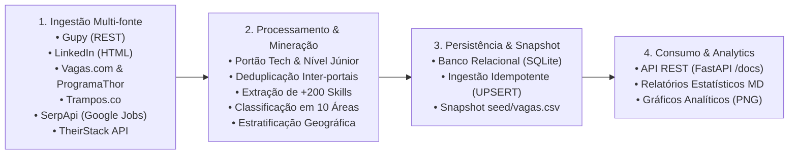

# Arquitetura e Funcionamento Técnico do Sistema

Este documento descreve detalhadamente o funcionamento interno, decisões arquiteturais, algoritmos de mineração e fluxo de dados do projeto de pesquisa **Mapeamento de Skills em Tecnologia no Brasil (PIBIC)**.

---

## 1. Visão Geral da Arquitetura

O sistema é estruturado em quatro camadas desacopladas e complementares:




---

## 2. Camada de Ingestão de Dados (`scraper/sources/`)

Todos os coletores herdam da classe abstrata base `JobSource` (`scraper/sources/base.py`), que define o contrato padrão de execução e isolamento de falhas:

```python
class JobSource(ABC):
    @abstractmethod
    def fetch_term(self, term: str) -> list[Job]:
        """Coleta as vagas de um único termo de busca."""
```

### 2.1 Resiliência HTTP (`PoliteSession`)
O tráfego de rede é gerenciado centralmente por `PoliteSession` (`scraper/http_client.py`), que implementa:
- **Exponential Backoff e Retries:** Em caso de erros transitórios (`429 Too Many Requests`, `500`, `502`, `503`), as requisições realizam novas tentativas com recuo exponencial.
- **Delay Educado:** Intervalo configurável entre chamadas (padrão de 1.5s) para respeito aos servidores públicos.
- **Headers Realistas:** Utilização de `User-Agent` moderno para evitar falsos bloqueios de tráfego.

### 2.2 Estratégias por Portal / API

| Coletor | Tipo de Integração | Estratégia de Paginação | Particularidades |
| :--- | :--- | :--- | :--- |
| **`gupy`** | API REST pública | Offset numérico (`offset = page * limit`) | A API da Gupy limita o tamanho de lote a 100 itens. |
| **`linkedin`** | HTML Scraping | Offset de cards (`start = page * 10`) | Filtra por `geoId=106057199` (Brasil) para evitar vagas globais. |
| **`vagas`** | HTML Scraping | Parâmetro de página (`?pagina=N`) | Utiliza slugificação de termos em URLs amigáveis (`/vagas-de-python`). |
| **`programathor`** | HTML Scraping | Parâmetro de página (`?page=N`) | Mapeia os ícones FontAwesome dos cards para extração dos atributos. |
| **`trampos`** | API REST pública | Parâmetro de página (`?page=N`) | Lê o nó `opportunities` da resposta estruturada. |
| **`serpapi`** | API REST (Google Jobs) | Cursor Token (`next_page_token`) | Acesso ao feed estruturado do Google Jobs no Brasil. |
| **`theirstack`** | API REST B2B | Paginação numérica (`"page": N`) | Enriquecimento prévio de tecnologias e filtragem por país (`BR`). |

---

## 3. Mineração, Normalização e Classificação

### 3.1 Portão de Relevância e Senioridade (`scraper/seniority.py`)
- **Filtragem de Nível de Entrada:** Utiliza regex balanceadas para identificar termos como *Júnior*, *Jr*, *Estágio*, *Internship*, *Trainee* e *Aprendiz*.
- **Descarte de Falsos Positivos:** Vagas sênior ou de liderança que contenham a palavra "júnior" no corpo (ex: *"capacidade de liderar juniores"*) são analisadas pelo classificador para evitar falsas inclusões.
- **Portão de Relevância Técnica:** Descarta automaticamente vagas não-relacionadas à computação (ex: *Analista Contábil*, *Assistente de DP*) capturadas por termos amplos.

### 3.2 Extração de Tecnologias (`scraper/skills.py`)
A taxonomia de habilidades é declarada em `scraper/rules/skills.yml`, contendo mais de **200 tecnologias canônicas** e centenas de sinônimos/aliases mapeados:

```yaml
- canonical: Python
  group: linguagens
  aliases: [python, python3, py]

- canonical: C#
  group: linguagens
  aliases: [c#, c-sharp, csharp]
```

- **Fronteiras de Palavra Seguras:** Tecnologias com caracteres especiais (como `C#`, `C++`, `.NET`, `Node.js`) utilizam regex customizadas para não serem corrompidas pelo comportamento padrão de `\b` do Python.
- **Zero Falsos Positivos:** O extrator ignora substrings acidentais (ex: a palavra `"go"` em inglês não ativa a linguagem *Go*).

### 3.3 Classificação por Área Técnica (`scraper/classifier.py`)
Cada tecnologia e palavra-chave do título possui pesos mapeados em `scraper/rules/areas.yml`. O algoritmo calcula uma pontuação para as 10 áreas técnicas:
1. `Backend`
2. `Frontend`
3. `Fullstack`
4. `Data` (Ciência, Engenharia e Análise de Dados)
5. `QA` (Qualidade e Testes de Software)
6. `DevOps` (Cloud, CI/CD e Infraestrutura moderna)
7. `Mobile` (Android, iOS, Flutter, React Native)
8. `Segurança` (Cybersecurity, AppSec, SOC)
9. `Suporte/Infra` (Redes, Hardware, Helpdesk)
10. `Outros/TI Geral`

### 3.4 Inferência de Modalidade e Regiões (`scraper/geo.py` & `scraper/models.py`)
- **Inferência de Modalidade (`infer_workplace`):**
  - Vagas com identificador `work_from_home` ou localidade `Brasil/Remoto` $\rightarrow$ `Remoto`.
  - Vagas com indicação de dias presenciais ou termos híbridos $\rightarrow$ `Híbrido`.
  - Vagas vinculadas a cidades físicas sem indicativo de trabalho de casa $\rightarrow$ `Presencial`.
- **Estratificação por Polos:** Mapeamento de 14 polos tecnológicos e 5 macrorregiões baseado em `scraper/rules/locations.yml`.

### 3.5 Deduplicação Inter-portais (`scraper/dedupe.py`)
Como uma mesma vaga de uma empresa frequentemente é publicada simultaneamente na Gupy, no LinkedIn e na Vagas.com, o sistema gera uma **impressão digital canônica (fingerprint)** combinando o título normalizado e o nome padronizado da empresa. Vagas com a mesma impressão digital são deduplicadas, mantendo a fonte primária.

---

## 4. Camada de Persistência e Estratégia de Dados

### 4.1 Modelagem Relacional (SQLAlchemy 2.0)
Definida em `api/models.py`:
- **`vagas`:** Armazena título, empresa, modalidade, data de publicação, área, senioridade, link, região e polo.
- **`tecnologias`:** Tabela dimensional contendo as tecnologias canônicas e seus grupos.
- **`vaga_tecnologia`:** Tabela associativa relacional $N:N$ que vincula vagas às tecnologias demandadas.

### 4.2 Ingestão Idempotente (`scripts/import_csv.py`)
O script realiza operações de **UPSERT**:
- Se a vaga (`source` + `external_id`) não existe no banco, realiza o `INSERT`.
- Se a vaga já existe, atualiza os campos de enriquecimento (`UPDATE`), garantindo que execuções sucessivas não corrompam nem dupliquem o banco de dados.

### 4.3 Snapshot Versionado (`scripts/export_seed.py`)
Para garantir a reprodutibilidade científica e permitir deploys na nuvem sem depender de arquivos SQLite locais, o comando `python scripts/export_seed.py` consolida todo o banco de dados no arquivo `seed/vagas.csv`.

---

## 5. API REST e Geração de Gráficos

### 5.1 FastAPI (`api/app.py`)
A API disponibiliza endpoints de consulta estruturada:
- `GET /vagas`: Listagem paginada com suporte a múltiplos filtros simultâneos (`area`, `tecnologia`, `modalidade`, `fonte`, `q`).
- `GET /tecnologias`: Ranking agregado de menções com parâmetro `com_vagas=true`.
- `GET /areas`: Distribuição percentual e absoluta de cada especialidade.
- `GET /docs`: Documentação interativa Swagger UI.

### 5.2 Geração Gráfica (`scraper/charts.py`)
Implementa gráficos com **Matplotlib** utilizando boas práticas de visualização científica:
- Gráficos de barras horizontais para categorias nominais.
- *Small multiples* para detalhamento de tecnologias por área.
- Rótulos diretos nas barras para dispensar linhas de grade excessivas.

---

## 6. Qualidade de Código e Testes

A suíte de testes automatizados é executada via **pytest** e conta com **mais de 260 testes unitários**:

```powershell
pytest
```

A cobertura de testes pode ser verificada com:
```powershell
pytest --cov=scraper --cov=api --cov-report=term-missing
```

---

## 🤝 Agradecimentos e Créditos

Este projeto de pesquisa acadêmica foi construído e expandido a partir da concepção e base inicial do repositório de código aberto [**vagas-tech-junior**](https://github.com/EmidioLP/vagas-tech-junior), idealizado e desenvolvido por:

- **Emidio Lopes de Souza Neto**
  - Repositório Original: [github.com/EmidioLP/vagas-tech-junior](https://github.com/EmidioLP/vagas-tech-junior)
  - GitHub: [@EmidioLP](https://github.com/EmidioLP)
  - LinkedIn: [emidio-lopes](https://www.linkedin.com/in/emidio-lopes/)

Expressamos nossos sinceros agradecimentos pelo trabalho fundacional de engenharia de raspagem e estruturação inicial que viabilizou a evolução para este framework de mineração de dados, taxonomia avançada e pesquisa científica (PIBIC).

---

## 📄 Licença

Este projeto é distribuído sob a licença **MIT**, em conformidade com a licença original do projeto base:

```text
MIT License

Copyright (c) 2026 Emidio Lopes


Permission is hereby granted, free of charge, to any person obtaining a copy
of this software and associated documentation files (the "Software"), to deal
in the Software without restriction, including without limitation the rights
to use, copy, modify, merge, publish, distribute, sublicense, and/or sell
copies of the Software, and to permit persons to whom the Software is
furnished to do so, subject to the following conditions:

The above copyright notice and this permission notice shall be included in all
copies or substantial portions of the Software.

THE SOFTWARE IS PROVIDED "AS IS", WITHOUT WARRANTY OF ANY KIND, EXPRESS OR
IMPLIED, INCLUDING BUT NOT LIMITED TO THE WARRANTIES OF MERCHANTABILITY,
FITNESS FOR A PARTICULAR PURPOSE AND NONINFRINGEMENT. IN NO EVENT SHALL THE
AUTHORS OR COPYRIGHT HOLDERS BE LIABLE FOR ANY CLAIM, DAMAGES OR OTHER
LIABILITY, WHETHER IN AN ACTION OF CONTRACT, TORT OR OTHERWISE, ARISING FROM,
OUT OF OR IN CONNECTION WITH THE SOFTWARE OR THE USE OR OTHER DEALINGS IN THE
SOFTWARE.
```
